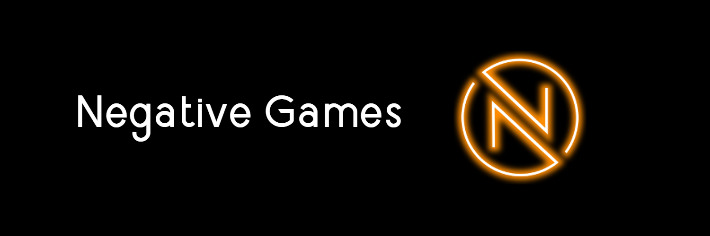

# 🏗 Framework Wiki


### <mark style="color:green;">**Framework 2.2.0 has released!**</mark>


Here you can find all information about Framework and how to use the different modules.

This wiki has been created by us and the community to give users of Framework an easy to access guide on how to use it.

We are always open to suggestions on how to make the wiki easier to understand.

If you feel like it needs updating, please create join the [Discord ](https://discord.negative.games)and create a ticket!

#### Popular Articles:


[commands.md](commands.md)



[message.md](message.md)



[database.md](database.md)

